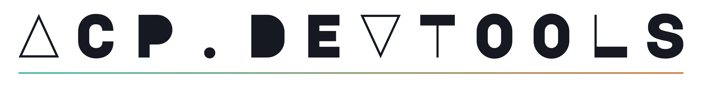
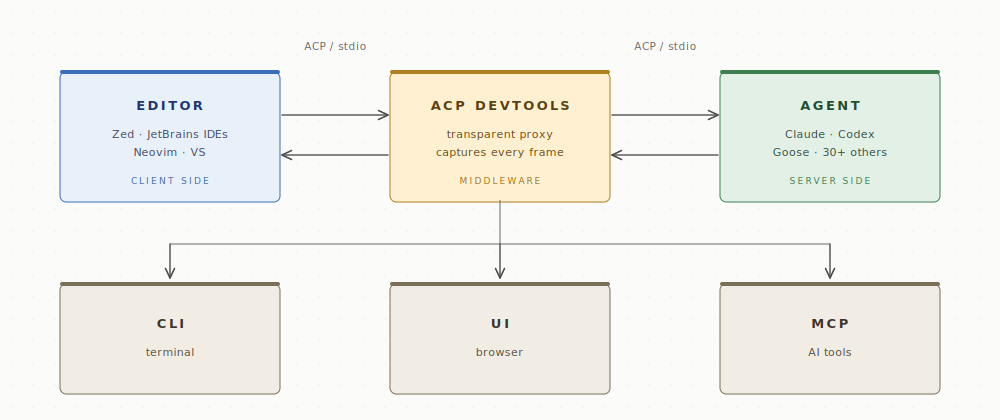

<p align="center">
  <picture>
    <source media="(prefers-color-scheme: dark)" srcset="assets/logo-dark.png">
    
  </picture>
</p>

<p align="center">
  <a href="https://github.com/maksugr/acp-devtools/actions/workflows/ci.yml"></a>
  <a href="LICENSE"></a>
  <a href="package.json"></a>
</p>

<p align="center">
  <picture>
    <source media="(prefers-color-scheme: dark)" srcset="assets/architecture-v2-dark.svg">
    
  </picture>
</p>

See exactly what your editor and your coding agent say to each other. ACP
Devtools captures every JSON-RPC frame between them, stores each session in
SQLite, and streams it to a live web inspector — replay, diff, spec-validation,
plus a CLI and a read-only MCP server.

```bash
npm install -g acp-devtools     # or: brew install maksugr/tap/acp-devtools
acp-devtools ui                 # → http://127.0.0.1:3737/
```

<p align="center">
  <video src="https://github.com/user-attachments/assets/a43f74ee-db25-4961-bf09-f085ab676634" autoplay loop muted playsinline width="820" aria-label="A 16-second tour: pick a session, click a frame to see its payload, cycle the Tree/Raw/Meta/Spec tabs, open the session-info drawer, open the performance dashboard with its waterfall, diff two sessions, switch theme."></video>
</p>

## What is ACP?

The [Agent Client Protocol](https://agentclientprotocol.com/get-started/introduction)
is an open, newline-delimited JSON-RPC wire format that lets an editor (Zed,
WebStorm, IntelliJ, Neovim, Visual Studio via ReSharper) drive a coding agent
(Claude Code, Codex, Goose, OpenCode, and
[30+ others](https://agentclientprotocol.com/get-started/agents)) over stdio,
without either side knowing the other's implementation. ACP Devtools sits in the
middle of that stdio pipe — neither side knows it's there.

## Who it's for

- **Agent authors** — see exactly what an editor sends, and validate your wire
  output against the spec.
- **Editor / plugin developers** — see what the *other* side sends (WebStorm and
  Zed disagree on capabilities, `_meta`, and id format) and test against
  recorded traffic without burning tokens.
- **Anyone debugging a chat** — find why `session/prompt` took 60s, or replay
  yesterday's broken session and step to the failing tool call.
- **CI** — gate releases on spec conformance and latency regressions, headless
  (exit-code-driven [recipe](docs/recipes.md#gate-a-build-in-ci)).

## Features

<details>
<summary><b>Transparent proxy</b> — captures every frame in both directions</summary>

Sits between editor and agent over stdio (newline-delimited JSON-RPC 2.0).
Neither side knows it's there.
</details>

<details>
<summary><b>Timeline + JSON detail</b> — vertical scroll of every frame, click for the payload</summary>

Each row shows direction, kind, method, rpc id, size, and latency to its paired
request. The detail panel renders the full payload as a spec-aware tree —
hover any field for its schema description, `⚠ ext` badges mark `_meta` and
fields not declared in the spec.
</details>

<details>
<summary><b>Stream clusters</b> — <code>agent_message_chunk</code> runs collapse to one <code>STR</code> row</summary>

A shimmer bar marks the cluster while chunks are still arriving — tells
«agent thinking» apart from «agent stuck». Click to expand the individual
chunks.
</details>

<details>
<summary><b>Spec validation</b> — every frame against the official ACP JSON schema</summary>

Invalid frames get a red `⚠ SPEC N` badge in the timeline, per-error ajv
details in the detail panel, and a footer aggregate across the session. CLI:
`acp-devtools validate <id>` exits 1 on violations — wire into CI.
</details>

<details>
<summary><b>Performance dashboard</b> — per-method p50/p99/max + waterfall + insights</summary>

Sortable table with latency sparklines, auto-detected insights (hotspot,
long-tail, outlier, busiest, errors), and a waterfall canvas with
gap-compression for multi-hour sessions. CLI mirror: `stats <id> --by-method`
— same percentile algorithm, same numbers to the millisecond.
</details>

<details>
<summary><b>Multi-session diff</b> — frame-level + metadata + per-method p99 deltas</summary>

LCS-aligned frame view with click-to-expand field-level changes, plus a
metadata diff layer (versions, capabilities) and a per-method p99-delta layer.
CLI: `diff <a> <b>` (add `--json` for machine output).
</details>

<details>
<summary><b>Session metadata</b> — versions, capabilities, mode/model, slash commands</summary>

Derived from the captured frames — client/agent versions, capability matrix,
runtime mode/model, available slash commands, JetBrains `_meta.proxyConfig`.
Drawer in the UI; CLI: `session-info <id>`; MCP: `get_session_summary`.
</details>

<details>
<summary><b>Cross-session search</b> — full-text across every saved frame</summary>

Click a result to jump to that row in the timeline. CLI: `search <pattern>`
with grep-style exit codes (1 if no match).
</details>

<details>
<summary><b>Replay</b> — play/pause/speed/seek through a saved session</summary>

UI scrubber with 1× / 2× / 4× speeds. CLI: `replay <id>` rebroadcasts over
WebSocket on a fixed port for repeatable demos.
</details>

<details>
<summary><b>Export / import</b> — JSON dumps you can share or re-import</summary>

Two engineers can debug the same capture without spinning up an editor.
Imported sessions appear in the picker tagged `IMPORTED`.
</details>

<details>
<summary><b>Mock agent / editor</b> — record-replay primitives for CI</summary>

`mock-editor --script <export.json>` drives a real agent with recorded editor
traffic (no IDE, no tokens burned); `mock-agent` does the inverse. Pair with
`validate` and `stats --json` for headless spec/latency gating.
</details>

<details>
<summary><b>Read-only MCP server</b> — 11 tools so an AI agent can query your captures</summary>

Tools: `list_sessions`, `get_session_summary`, `find_spec_violations`,
`diff_sessions`, `search_messages`, and 6 more. Wire via `acp-devtools mcp`
and add to your AI agent's MCP config.
</details>

<details>
<summary><b>Concurrent captures</b> — multiple editor windows in one inspector tab</summary>

Every capture registers in `~/.acp-devtools/active/<pid>.json` with an
ephemeral port. The session picker auto-discovers them — no port conflicts
even with several chats open.
</details>

## Quickstart

```bash
# Install (zero-install via npx also works)
npm install -g acp-devtools          # or: brew install maksugr/tap/acp-devtools
npx acp-devtools ui                  # no install — downloads on first run

# Verify
acp-devtools doctor                  # Node, binary path, state, detected editors

# Open the inspector
acp-devtools ui                      # → http://127.0.0.1:3737/ (auto-opens)
```

Connect Zed (as an example) — open `~/.config/zed/settings.json` (`Cmd+,`) and merge:

```json
{
    "agent_servers": {
        "Claude Code (via ACP Devtools)": {
            "type": "custom",
            "command": "acp-devtools"
        }
    }
}
```

That's the whole config for the default Claude Code setup — `acp-devtools`
detects it was spawned by an editor (stdin is a pipe) and runs
`proxy --agent claude-code` internally. Send a prompt → the proxy spawns the
agent, and the inspector picks up the live capture.

> If Zed reports "agent command not found", replace `"acp-devtools"` with the
> absolute path from `which acp-devtools` — GUI apps inherit a minimal `PATH`
> that often misses Node binaries.

Per-editor setups — each covers Claude Code, Codex, Goose, OpenCode, and how to
wrap a custom agent — plus a Claude Code multi-profile / auth recipe:

- [Zed setup with every agent](examples/zed-config.md)
- [JetBrains setup (WebStorm / IntelliJ / PyCharm / …)](examples/jetbrains-config.md)
- [Claude Code multi-profile (personal vs work OAuth)](examples/claude-code-setup.md)

## The inspector

A vertical timeline of every frame plus a JSON detail panel. Frames stream in
live; clicking a row expands its payload, with latency annotations, stream
clustering, spec badges, a performance waterfall, replay controls, and a
session diff view.

```
 ◢◣◢◣ acp.devtools  v0.1.0   SESSION #21 · alive 12m · idle 4s    ● LIVE  ⌘K

[→ OUT] [← IN]    REQ  RSP  NTF  ERR  STR    □ hide set_mode/set_model

 003  19:01:09.527  → AGENT  REQ  session/new          id:2    159B
 004  19:01:10.503  ← AGENT  RSP  —                    id:2   2.6KB  +976ms
 006  19:01:13.721  → AGENT  REQ  session/prompt  "hi" id:3    188B
 ▎07  19:01:16.520  ← AGENT  STR  Hi! What would you like to   236ms
 010  19:01:16.931  ← AGENT  RSP  —                    id:3     59B  +3.21s

 MSGS 13  REQ 3  RSP 3  NTF 7  ERR 0    P50 976MS  P99 3.21S
```

Full tour — labels, detail tabs, perf dashboard, diff panel, shortcuts:
**[docs/ui.md](docs/ui.md)**.

## The CLI

One binary, eighteen subcommands — every UI control has a headless equivalent,
colorized and grep/jq-friendly. The inspector is one frontend, not a hard
dependency.

```bash
acp-devtools list                                  # saved sessions, newest first
acp-devtools stats 23 --by-method                  # latency percentiles
acp-devtools inspect 23 --kind req --grep prompt   # filtered timeline, in the terminal
acp-devtools diff 23 41                             # what changed between two sessions
acp-devtools <command> --help                       # grouped, colorized help
```

Full reference: **[docs/cli.md](docs/cli.md)**. Task-driven walkthroughs
(headless debugging, A/B two agents, mock-based CI): **[docs/recipes.md](docs/recipes.md)**.

## Debug Claude with Claude (MCP)

`acp-devtools mcp` exposes saved captures to Claude Code as read-only MCP tools,
so you can ask:

> «find spec violations in the last 10 sessions» ·
> «compare p99 of `session/prompt` between WebStorm and Zed»

Setup and the eleven tools: **[docs/mcp.md](docs/mcp.md)**.

## Supported agents

The built-in registry covers four agents. npm-based agents auto-install on first
use via `npx -y …`; binary-based agents need a one-time install.

| Shortcut | What it runs | Install |
|---|---|---|
| `claude-code` *(default)* | `npx -y @agentclientprotocol/claude-agent-acp` | npx — automatic |
| `codex` | `npx -y @zed-industries/codex-acp` | npx — automatic |
| `goose` | `goose acp` | install Goose from <https://goose-docs.ai> first |
| `opencode` | `opencode acp` | `curl -fsSL https://opencode.ai/install \| bash` |

For Cursor, GitHub Copilot, Cline, Junie, and 25+ others, see the
[ACP agents directory](https://agentclientprotocol.com/get-started/agents) and
use the explicit form: `acp-devtools proxy <your-command> [args…]`.

## Architecture

```
   Editor (Zed / JetBrains / Neovim / VS via ReSharper)
            │  ACP via stdio (newline-delimited JSON-RPC 2.0)
            ▼
   ┌─────────────────────────────────────────┐
   │  acp-devtools proxy                      │
   │   spawns the agent                       │
   │   captures every frame in both directions│
   │   writes ~/.acp-devtools/captures.db     │
   │   broadcasts on a local WebSocket        │
   │   registers ~/.acp-devtools/active/      │
   └──────────────┬──────────────────────────┘
                  │ stdio
                  ▼
        ACP agent (claude-agent-acp, codex-acp, …)

   Browser ◄── HTTP ──── acp-devtools ui (3737)
                          serves the React bundle + discovers live captures
```

Neither side of the pipe knows the proxy exists. Multiple captures (one chat per
editor window) coexist on independent ephemeral ports and all appear in the
inspector's session picker.

## Documentation

- [CLI reference](docs/cli.md) — every command, flag, and sample output
- [The inspector (UI)](docs/ui.md) — timeline, detail panel, perf, diff
- [MCP server](docs/mcp.md) — tools and setup
- [Recipes](docs/recipes.md) — headless debugging, diffing, mock-based testing
- [Contributing](CONTRIBUTING.md) — build from source, layout, conventions

---

Co-developed with [Claude Code](https://claude.com/claude-code) (Opus). Pair-programmed,
but every line was read, shaped, and handcrafted by an experienced human, with love 🖤

## License

MIT — see [LICENSE](LICENSE).
